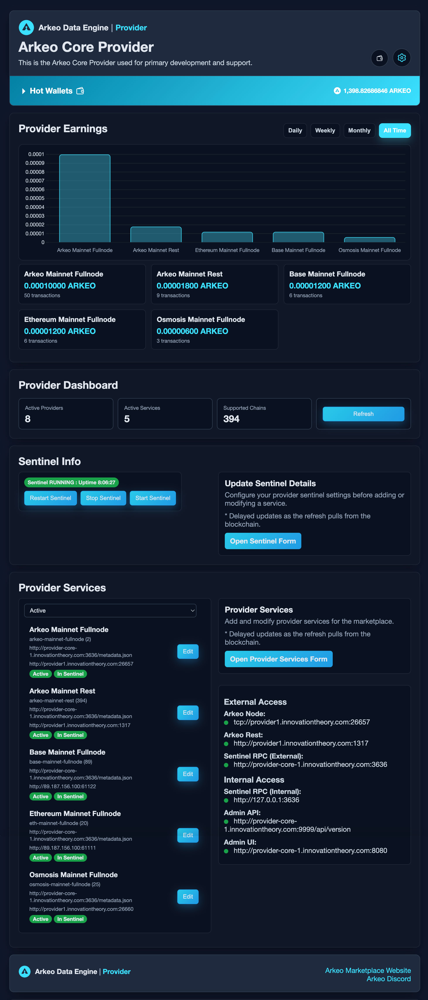
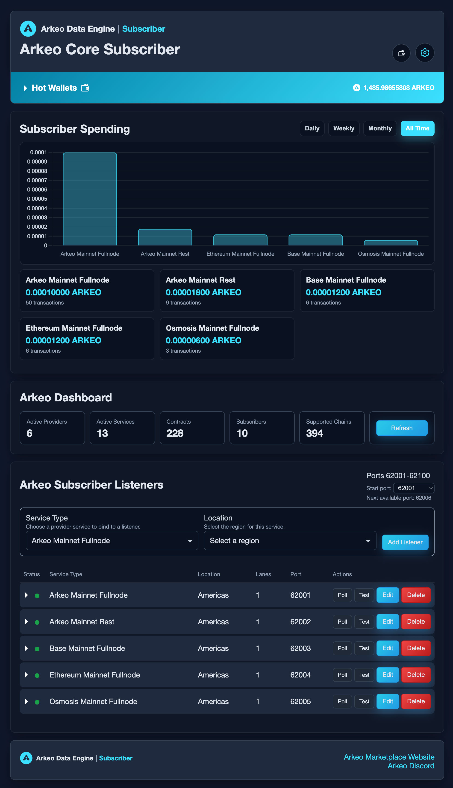

# The Arkeo Data Marketplace
This repository delivers production‑ready Docker images to help teams earn more by publishing blockchain data services as providers, or reduce costs and simplify access by consuming data as subscribers in the Arkeo Data Marketplace. For current network activity and available services, see the [Arkeo Data Marketplace](https://marketplace.builtonarkeo.com).

## 🔹 Arkeo Data Engine - Provider
In this docker image, you can use an admin UI to connect your blockchain data nodes to the Arkeo Data Marketplace and earn Arkeo tokens for the data you provide with a blockchain-based pay-as-you-go model.

<strong>🖼️ Preview the "Arkeo Data Engine - Provider" admin UI</strong>

➡️ Read the full guide: [provider-core/README.md](provider-core/README.md).

## 🔹 Arkeo Data Engine - Subscriber
In this docker image, you can use an admin UI to create subscriber proxies for the Arkeo Data Marketplace that automatically handle pay-as-you-go blockchain contracts with top providers.

<strong>🖼️ Preview the "Arkeo Data Engine - Subscriber" admin UI</strong>

➡️ Read the full guide: [subscriber-core/README.md](subscriber-core/README.md).
