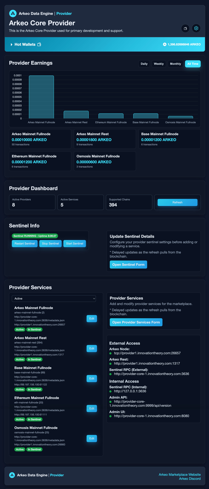
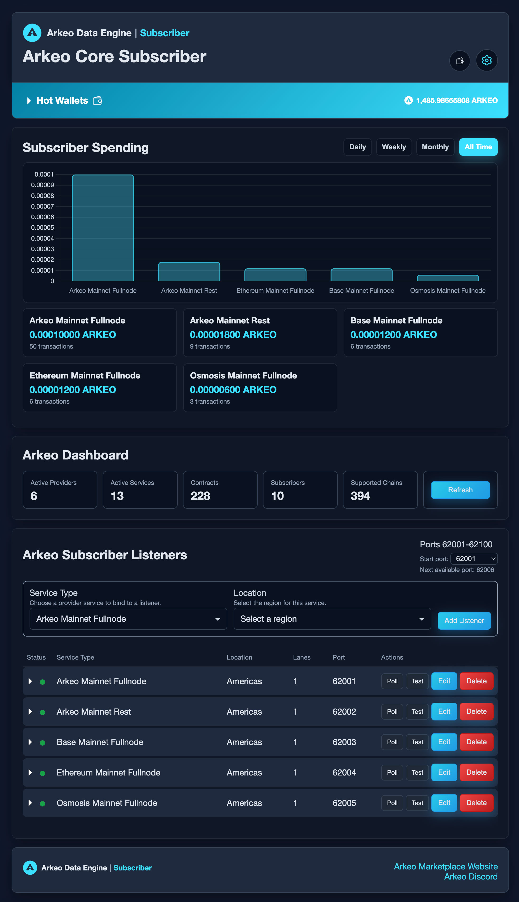

# The Arkeo Data Marketplace
This repository contains the provider, subscriber and dashboard components of the Arkeo Data Marketplace. The RPC rebuild is a **review candidate, not approved for production**. Its tests and recorded demo do not establish live provider availability or funded settlement.

**Continuing the rebuild? Start with [the agent handoff and detailed prompt](docs/ARKEO_REBUILD_AGENT_HANDOFF.md).** It identifies both repositories, exact revisions, test evidence, known failures and the remaining live-demo gates. Use branch `codex/institutional-readiness-audit`; the rebuild has not been merged into `main`.

The existing marketplace is [arkeomarketplace.com](https://arkeomarketplace.com). Its deployed pages are not evidence that this review branch has been deployed.

## 🔹 Arkeo Data Engine - Provider
In this docker image, you can use an admin UI to connect your blockchain data nodes to the Arkeo Data Marketplace and earn Arkeo tokens for the data you provide with a blockchain-based pay-as-you-go model.

<strong>🖼️ Preview the "Arkeo Data Engine - Provider" admin UI</strong>

➡️ Read the full guide: [provider-core/README.md](provider-core/README.md).

## 🔹 Arkeo Data Engine - Subscriber
In this docker image, you can use an admin UI to create subscriber proxies for the Arkeo Data Marketplace that automatically handle pay-as-you-go blockchain contracts with top providers.

<strong>🖼️ Preview the "Arkeo Data Engine - Subscriber" admin UI</strong>

➡️ Read the full guide: [subscriber-core/README.md](subscriber-core/README.md).
